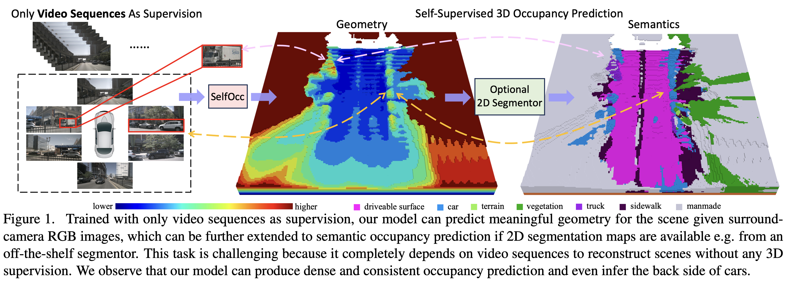
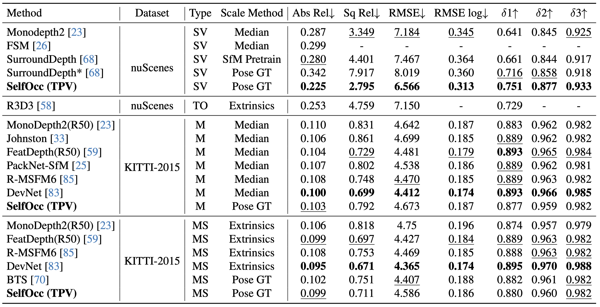

# SelfOcc: Self-Supervised Vision-Based 3D Occupancy Prediction
### [Paper](https://arxiv.org/pdf/2311.12754)

> SelfOcc: Self-Supervised Vision-Based 3D Occupancy Prediction

> [Yuanhui Huang](https://scholar.google.com/citations?hl=zh-CN&user=LKVgsk4AAAAJ)*, [Wenzhao Zheng](https://wzzheng.net/)\* $\dagger$, [Borui Zhang](https://boruizhang.site/), [Jie Zhou](https://scholar.google.com/citations?user=6a79aPwAAAAJ&hl=en&authuser=1), [Jiwen Lu](http://ivg.au.tsinghua.edu.cn/Jiwen_Lu/)$\ddagger$

\* Equal contribution $\dagger$ Project leader $\ddagger$ Corresponding author

## Demo

### Trained using only video sequences and poses


### Trained using an additional off-the-shelf 2D segmentor 


### A full demo video can be downloaded [here](https://cloud.tsinghua.edu.cn/d/640283b528f7436193a4/).

## Introduction

3D occupancy prediction is an important task for the robustness of vision-centric autonomous driving, which aims to predict whether each point is occupied in the surrounding 3D space. Existing methods usually require 3D occupancy labels to produce meaningful results. However, it is very laborious to annotate the occupancy status of each voxel. In this paper, we propose SelfOcc to explore a self-supervised way to learn 3D occupancy using only video sequences. We first transform the images into the 3D space (e.g., bird's eye view) to obtain 3D representation of the scene. We directly impose constraints on the 3D representations by treating them as signed distance fields. We can then render 2D images of previous and future frames as self-supervision signals to learn the 3D representations. We propose an MVS-embedded strategy to directly optimize the SDF-induced weights with multiple depth proposals. Our SelfOcc outperforms the previous best method SceneRF by 58.7\% using a single frame as input on SemanticKITTI and is the first self-supervised work that produces reasonable 3D occupancy for surround cameras on Occ3D. SelfOcc produces high-quality depth and achieves state-of-the-art results on novel depth synthesis, monocular depth estimation, and surround-view depth estimation on the SemanticKITTI, KITTI-2015, and nuScenes, respectively. 

### Overview


### Framework


### Results

#### Nuscenes 3D Occupancy Prediction


#### Semantic KITTI  3D Occupancy Prediction


#### Novel Depth Synthesis


#### Depth Estimation



## Code

Coming soon!

## Related Projects

Our code is based on [TPVFormer](https://github.com/wzzheng/TPVFormer) and [PointOcc](https://github.com/wzzheng/PointOcc). 

Also thanks to these excellent open-sourced repos:
[SurroundOcc](https://github.com/weiyithu/SurroundOcc) 
[OccFormer](https://github.com/zhangyp15/OccFormer)
[BEVFormer](https://github.com/fundamentalvision/BEVFormer)

## Citation

If you find this project helpful, please consider citing the following paper:
```
@article{huang2023self,
    title={SelfOcc: Self-Supervised Vision-Based 3D Occupancy Prediction},
    author={Huang, Yuanhui and Zheng, Wenzhao and Zhang, Borui and Zhou, Jie and Lu, Jiwen },
    journal={arXiv preprint arXiv:2311.12754},
    year={2023}
}
```
